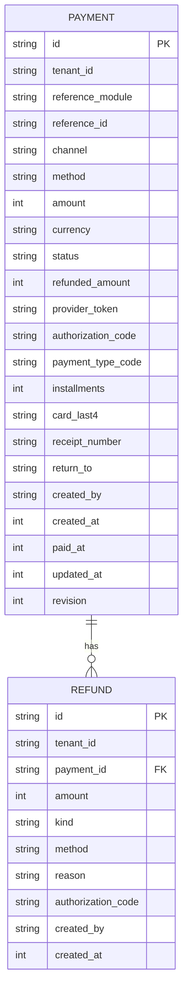

```mermaid
erDiagram
    PAYMENT {
        string id PK
        string tenant_id
        string reference_module
        string reference_id
        string channel
        string method
        int amount
        string currency
        string status
        int refunded_amount
        string provider_token
        string authorization_code
        string payment_type_code
        int installments
        string card_last4
        string receipt_number
        string return_to
        string created_by
        int created_at
        int paid_at
        int updated_at
        int revision
    }

    REFUND {
        string id PK
        string tenant_id
        string payment_id FK
        int amount
        string kind
        string method
        string reason
        string authorization_code
        string created_by
        int created_at
    }

    PAYMENT ||--o{ REFUND : has
```
